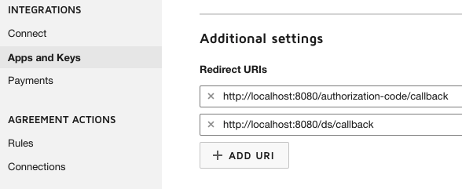
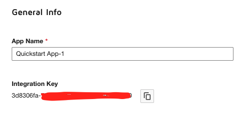
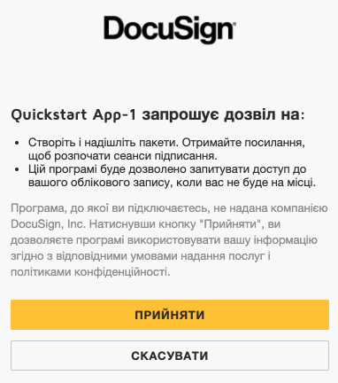
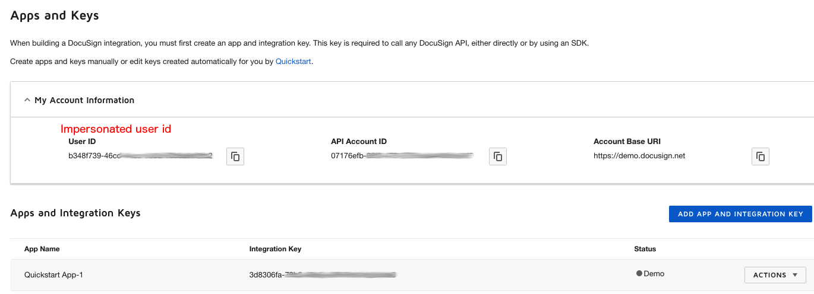
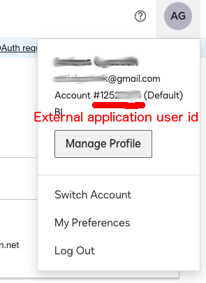
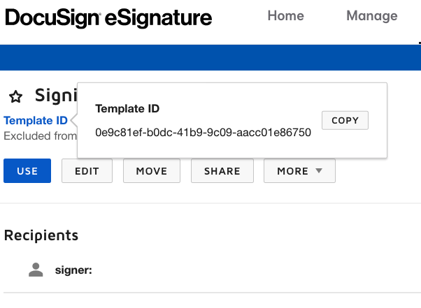
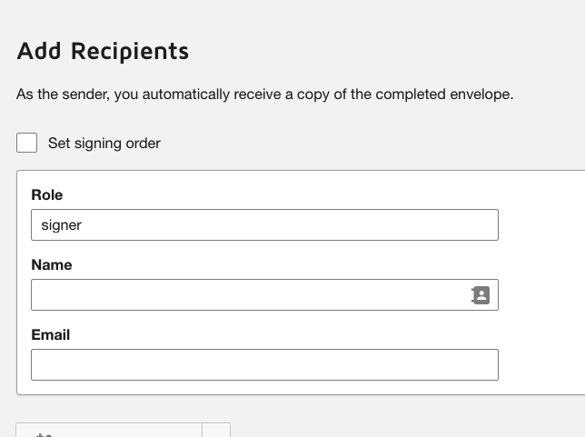

# Flask-DocuSign

## Description
This package allows easy integrate your Flask application with DocuSign API.

The package is using impersonated user aka [JWT Grant](https://developers.docusign.com/platform/auth/jwt/jwt-best-practice/)
as integration mode.


## Installation

```bash
pip install flask-docusign
```

## Usage

### Step 1. Grant permissions
Before using DocuSign API through impersonated user you have to grant permissions for your application to do this.
For this you have to execute the next query in your browser:
```bash
    https://account-d.docusign.com/oauth/auth?response_type=code&scope=signature%20impersonation&client_id=YOUR_INTEGRATOR_KEY&redirect_uri=YOUR_REDIRECT_URI
```
In the example above, we are using demo account, that's why we use **account-d.docusign.com** domain. For your production account you could use **account.docusign.com**

Please, note that **YOUR_REDIRECT_URI** should be registered in the platform.




**YOUR_INTEGRATOR_KEY** can be found as well on settings page of your project.




In case of correct call you will see the next page (in my case it is in Ukrainian) and after approving your application will be able to use DocuSign API.





### Step 2. Configure your application
The package expects configuration parameters to be passed inside dictionary like object.
Next config variables are required:


    # Base URL should be different on production - account.docusign.com
    BASE_URL = os.getenv('DS_BASE_URL', 'https://demo.docusign.net/restapi')
    APP_URL = "http://localhost:8080"

    BASE_URI_SUFFIX = "/restapi"

    # How get template id is described below
    DS_TEMPLATE_ID = os.getenv('DS_TEMPLATE_ID')

    # The app's DocuSign integration key
    DS_CLIENT_ID = os.getenv('DS_CLIENT_ID')

    # Application secret
    DS_CLIENT_SECRET = os.getenv('DS_CLIENT_SECRET')

    DS_EXT_APP_USER_ID = os.getenv('DS_EXT_APP_USER_ID')

    # For demo accounts - account-d.docusign.com,
    # for production accounts - account.docusign.com
    DS_AUTHORIZATION_SERVER = os.getenv('DS_AUTHORIZATION_SERVER', account-d.docusign.com)

    # The id of the user.
    DS_IMPERSONATED_USER_ID = os.getenv('DS_IMPERSONATED_USER_ID')

    # RSA key generated by DocuSign platform
    PRIVATE_KEY_FILE = os.getenv('PRIVATE_KEY_FILE')

#### How get you credentials
In admin console go on tab **Settings**, then select **App and keys**

1. Get impersonated user id and integration key. You can get impersonated user id from **App and keys** page. Integration key will be listed for every project as well.



2. Get external application user id (DS_EXT_APP_USER_ID). In the top right click on your avatar and you will see the next modal window:



3. Application secret (DS_CLIENT_SECRET) and private key file (PRIVATE_KEY_FILE) you can get from you application page. For this purpose click on 
   **Actions** select menu and select **Edit** then in **Authentication** you can generate secret key for your application.
   In **Service Integration** you have to generate RSA. **Important!** When you provide RSA key as environment variable you have to preserve RSA 
   structure with '\n' (separating every new row) in other case Python will fail to parse it. 

### Step 3. Your DocuSign template
You have to upload a document template which users will sign. When your document will be uploaded you can get it's template id.
Usually template id can be taken from URL in a browser address line or from 'Template ID' link:



Then you have to define **recipient** role for you template. For this you have to press 'Edit' button on the template's page.
Then you will see the next:



Usually it doesn't make a sense to specify name or email, so we come with role only. In my case I use 'signer' role name.
You can specify role name you like.

### Step 4. Define request handling logic

Request handling endpoints look very simple when you use the package.
Here is an example:

```python
@ds.route('/', methods=['POST'])
def docusign_create_envelope():
    """Creates envelope and submits it to DocuSign, as response 
    receives signing URL for user to follow.
    """
    config = current_app.config
    msg, status = create_envelope(config, request, session)
    return jsonify({'msg': msg}), status


@ds.route("/callback")
def ds_callback():
    """
    Save the token information in session.
    Call api to get user's information if it doesn't present.
    """
    # Save the redirect eg if present
    config = current_app.config
    set_client_cookie(config, session)
    return redirect('docusign_create_envelope')


@ds.route("/check/<envelope_id>", methods=['GET'])
def ds_check_envelope(envelope_id):
    """Check signing state."""
    state = 401
    if not len(envelope_id):
        return jsonify({'msg': 'Please verify your envelope id.'}), state
    config = current_app.config
    response, state = check_envelope(config, session, envelope_id)
    return jsonify({'msg': response}), state
```

Example application can be found in **example** folder.

You can run example application with your DocuSign project credentials.
Post request on http://localhost:8080/ds/ with payload:
```javascript
{
    "phone_number": "+491111111111111",
    "full_name": "Arnrn Bcd",
    "client_user_id": "1234567",
    "email": "a11i.bbk@gmail.com"
}
```
should return response similar to:
```javascript
{
    "msg": {
        "envelopeId": "59840612-14a8-45fd-83ad-82aaaaaaaaaa",
        "url": "https://demo.docusign.net/Signing/MTRedeem/v1/073929ed-e7a5-4902-a1e1-da8af5afa787?slt=eyJ0eXAiOiJNVCIsImFsZyI6IlJTMjU2Iiwia2LWFlNTctN2Q1MDgxZGRkZjAxIiwiRXhwaX..."
    }
}
```